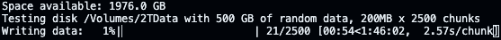

# Disk Tester

Disk tester, writes and validates random data to a filesystem on the disk. Writes data in simple chunks with checksum files.



Written in python

# Usage

### Run a test

`$ disktester test -f <place where disk is mounted>`

### Clean test directory

`$ disktester clean -f <place where disk is mounted>`

## Other

### Revalidate files

`$ disktester validate -f <place where disk is mounted>`

Feature not implemented - however can be useful for old drives with a prior test

# Help

```
./disktester.py --help                                       
usage: disktester.py [-h] [-f FOLDER] [-s SIZE] [-c CHUNKSIZE] action

Disk tester, writes and validates random data to disk in chunks with checksum files

positional arguments:
  action                Action to perform: test or clean

options:
  -h, --help            show this help message and exit
  -f, --folder FOLDER   Folder to test or clean
  -s, --size SIZE       Size of random data to write in GB. Leave some freespace for .sha1 checksum files
  -c, --chunksize CHUNKSIZE
                        Size of each chunk file in MB
```